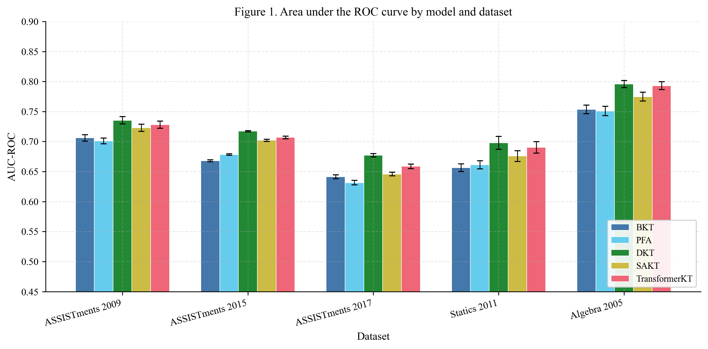
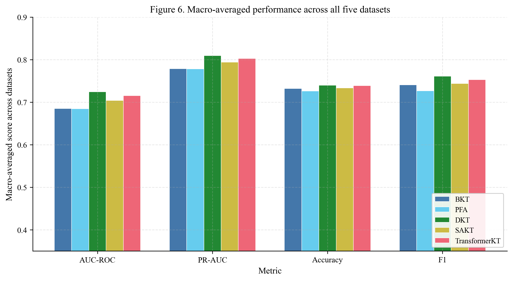

# Benchmarking Knowledge Tracing Methods Across Five Educational Datasets

A systematic comparison of five knowledge tracing (KT) methods spanning three methodological generations, evaluated on five publicly available educational datasets using a unified protocol.

## Overview

Knowledge tracing is the task of modeling student knowledge over time to predict future performance. This benchmark compares:

- **BKT** (Bayesian Knowledge Tracing) -- Hidden Markov Model with forward-backward EM (Corbett & Anderson, 1995)
- **PFA** (Performance Factors Analysis) -- Logistic regression with skill-gated success/failure counts (Pavlik et al., 2009)
- **DKT** (Deep Knowledge Tracing) -- LSTM-based sequence model (Piech et al., 2015)
- **SAKT** (Self-Attentive Knowledge Tracing) -- Single-head self-attention (Pandey & Karypis, 2019)
- **TransformerKT** -- Multi-head causal Transformer baseline

All models are evaluated on the **identical prediction subset** using a common prediction mask that excludes first skill encounters and chunk-boundary positions, ensuring a fair comparison between classical and deep learning approaches.

## Datasets

| Dataset | Interactions | Students | Skills | Correct Rate |
|---|---|---|---|---|
| ASSISTments 2009 | 278,336 | 3,114 | 149 | 65.9% |
| ASSISTments 2015 | 656,154 | 14,228 | 100 | 73.0% |
| ASSISTments 2017 | 934,638 | 1,708 | 411 | 37.4% |
| Statics 2011 | 189,297 | 282 | 98 | 76.5% |
| Algebra 2005 | 606,983 | 567 | 271 | 75.5% |

## Results

### AUC-ROC by Model and Dataset

| Dataset | BKT | PFA | DKT | SAKT | TransformerKT |
|---|---|---|---|---|---|
| ASSISTments 2009 | .706 | .701 | **.735** | .723 | .728 |
| ASSISTments 2015 | .668 | .678 | **.717** | .702 | .707 |
| ASSISTments 2017 | .641 | .631 | **.677** | .646 | .659 |
| Statics 2011 | .656 | .661 | **.698** | .676 | .690 |
| Algebra 2005 | .753 | .751 | **.796** | .775 | .793 |
| **Macro avg.** | **.685** | **.685** | **.725** | **.704** | **.715** |

### Key Findings

1. **DKT leads across all datasets.** DKT achieves the highest macro-averaged AUC-ROC (0.725), outperforming classical methods by ~4 percentage points and attention-based models by 1--2 percentage points.

2. **Transformer models do not justify their cost.** TransformerKT trails DKT by 0.9 AUC percentage points while requiring 2.9x more training time. SAKT trails by 2.0 points.

3. **Classical methods are stronger than often reported.** With proper implementations (forward-backward EM for BKT, categorical skill encoding for PFA), both achieve macro AUC of 0.685 -- competitive on datasets with long interaction histories (BKT reaches 0.753 on Algebra 2005).

4. **The DL advantage is metric-dependent.** Differences in AUC-ROC and PR-AUC are substantial, but accuracy and F1 differences are smaller and sometimes favor classical models on individual datasets.

5. **Student-clustered bootstrap CIs confirm significance.** Using student-level resampling (not interaction-level), DKT's confidence intervals are non-overlapping with classical methods on most datasets.

### Figures

<p align="center">
  
</p>

<p align="center">
  
</p>

## Evaluation Protocol

- **5-fold student-level cross-validation** -- all interactions from a student appear in either train or test, never both
- **Common prediction mask** -- excludes each student's first encounter with each skill and chunk-boundary positions (positions 0, 200, 400... per student), so classical and DL models are scored on identical subsets
- **5 metrics** -- AUC-ROC, PR-AUC, accuracy, F1, RMSE
- **Student-clustered bootstrap CIs** -- 1,000 resamples at the student level for AUC-ROC and PR-AUC, accounting for within-student correlation

## Project Structure

```
.
├── src/
│   ├── preprocess.py          # Data loading, chunking, fold creation
│   ├── models_v2.py           # All 5 model implementations + evaluation utilities
│   ├── run_benchmark.py       # Unified benchmark runner (all models x datasets x folds)
│   ├── visualize.py           # Figure generation (6 figures, PNG + PDF)
│   └── update_tables.py       # Extract results for paper table updates
├── data/                      # CSV datasets (not included, see below)
├── output/
│   └── benchmark_results.json # Full results with per-fold details and CIs
├── figures/                   # Generated figures (PNG + PDF)
├── paper.md                   # Full paper in Markdown
├── paper.docx                 # Formatted paper (DOCX)
└── generate_docx.js           # DOCX generator (Node.js, uses docx library)
```

## Reproducing the Benchmark

### 1. Data

Download the five datasets and place them as CSV files in `data/`:

- [ASSISTments 2009](https://sites.google.com/site/assistmaborern/dataset)
- [ASSISTments 2015](https://sites.google.com/site/assistmaborern/dataset)
- [ASSISTments 2017](https://sites.google.com/site/assistmaborern/dataset)
- [Statics 2011](https://pslcdatashop.web.cmu.edu/DatasetInfo?datasetId=507)
- [Algebra 2005](https://pslcdatashop.web.cmu.edu/DatasetInfo?datasetId=76)

Each CSV must contain columns: `user_id`, `skill_id`, `correct`, and optionally `item_id`.

### 2. Dependencies

```bash
pip install numpy scipy scikit-learn torch
pip install matplotlib  # for figure generation
```

### 3. Run

```bash
cd src
python3 run_benchmark.py
```

This runs all 5 models on all 5 datasets with 5-fold CV (125 total experiments). Expect ~2--3 hours on a modern CPU. Results are saved to `output/benchmark_results.json`.

### 4. Generate Figures

```bash
python3 visualize.py
```

## License

MIT
